# 🎓 Smart Knowledge Gap & Personalized Learning System

<div align="center">

**A concept-level diagnostic and personalized learning platform**
**that identifies knowledge gaps, prioritizes learning needs, and generates prerequisite-aware learning paths.**

[](https://www.python.org/)
[](https://flask.palletsprojects.com/)
[](https://scikit-learn.org/)
[](https://supabase.com/)
[](https://qdrant.tech/)
[](https://www.docker.com/)
[](https://github.com/qamarsobhy7-source/Smart-Knowledge-Gap-System/actions)
[](#-testing)
[](LICENSE)

</div>

---

## 🌐 Live Demo

🚀 **The application is live and production-ready:**

### 🔗 [https://smart-knowledge-gap-system-qqbms.faable.link](https://smart-knowledge-gap-system-qqbms.faable.link)

### 🎥 [Watch the Demo Video](https://rawcdn.githack.com/qamarsobhy7-source/Smart-Knowledge-Gap-System/c92c6b46449c71f990cd0b978664b6af20de7720/docs/videos/demo.mp4)

---

## 📸 Screenshots

### 🏠 Homepage — Landing with signup form
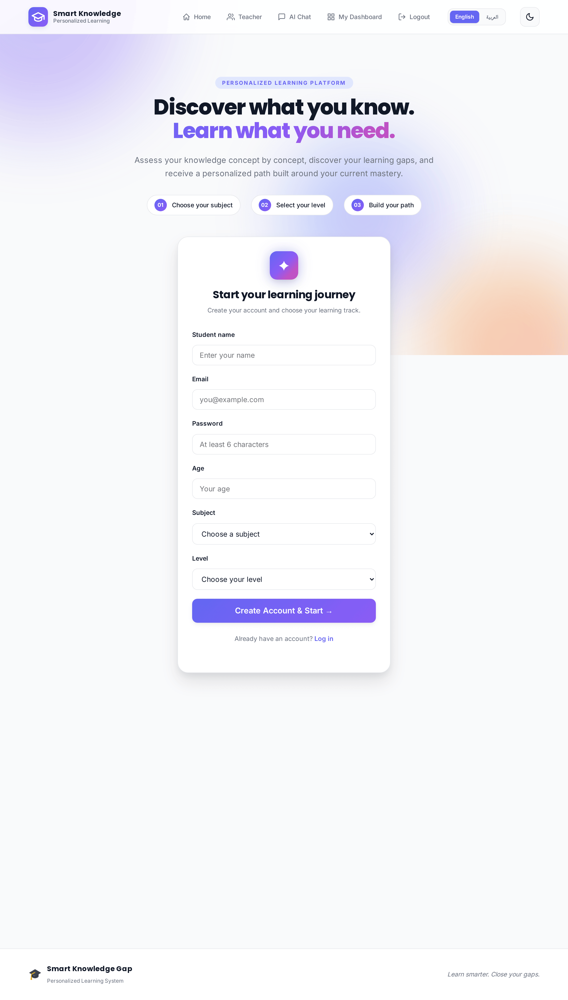

### 🔐 Authentication

| Login | Forgot Password |
|:-----:|:---------------:|
| 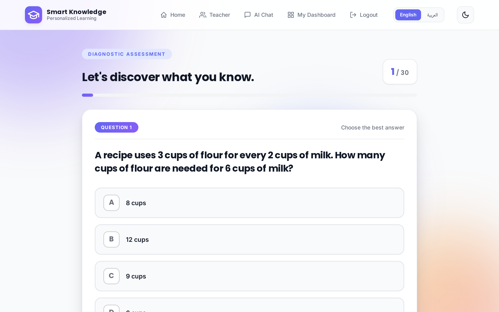 | 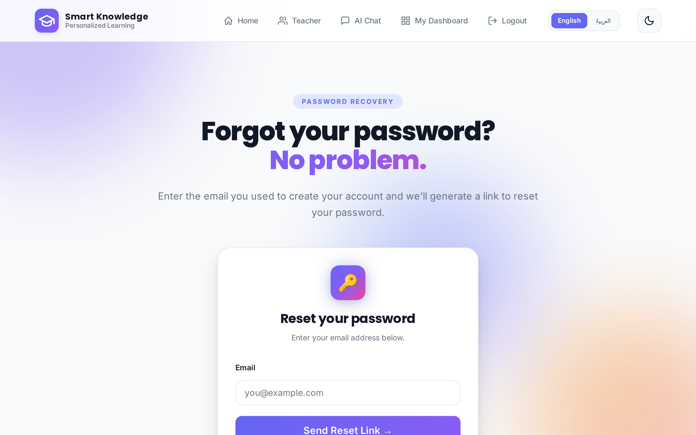 |

### 📝 Registration Form
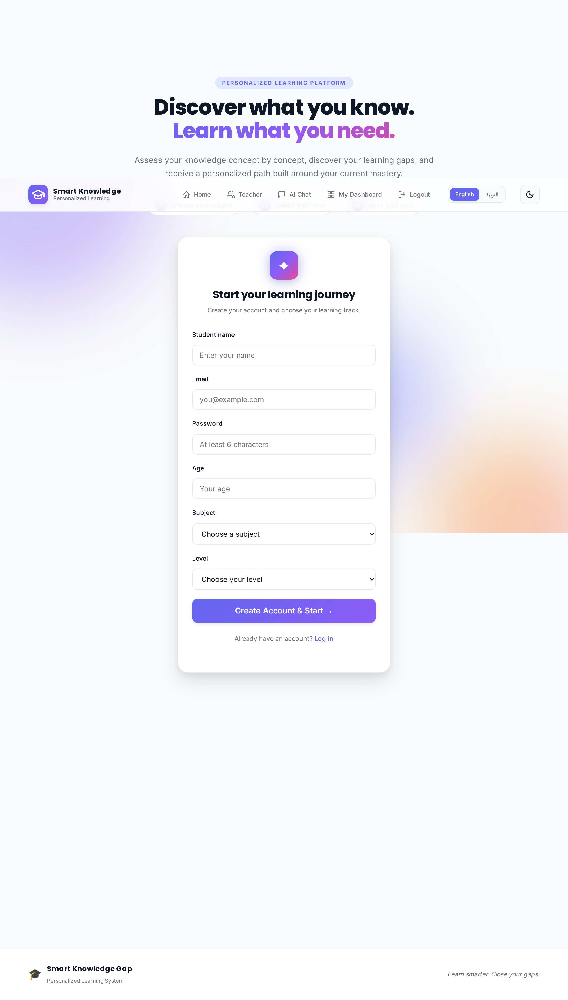

### 📊 Student Dashboard — Progress, Charts & Achievements
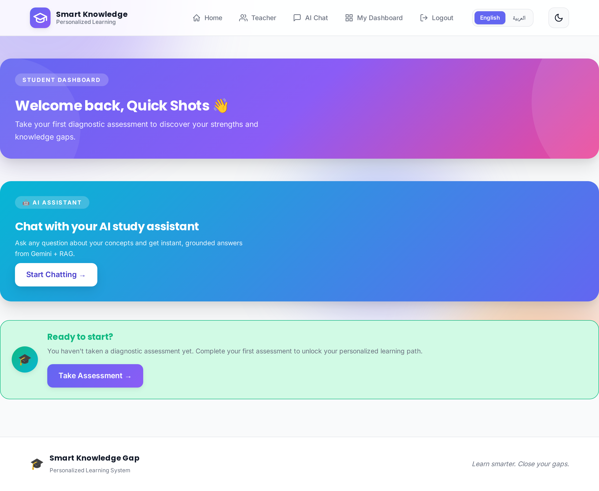

### 🧪 Adaptive Assessment — Question View
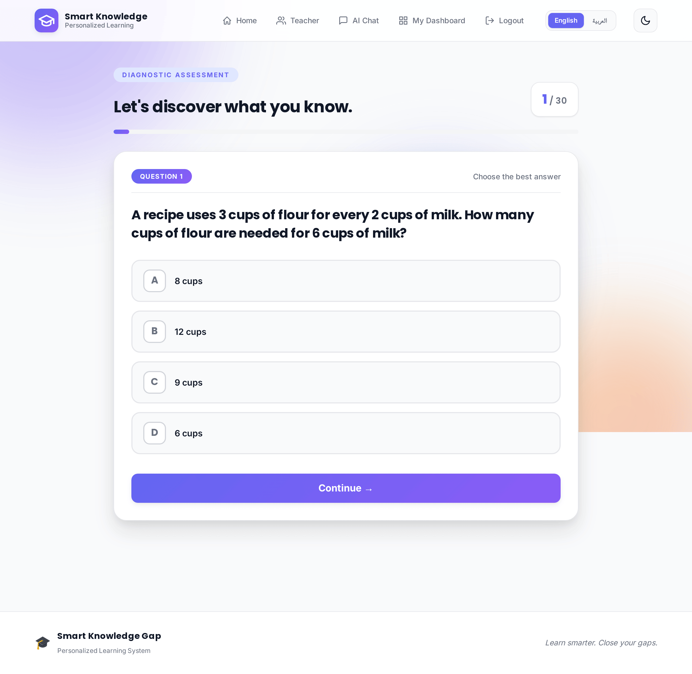

### 🤖 AI Insights — Clusters, SHAP & Recommendations
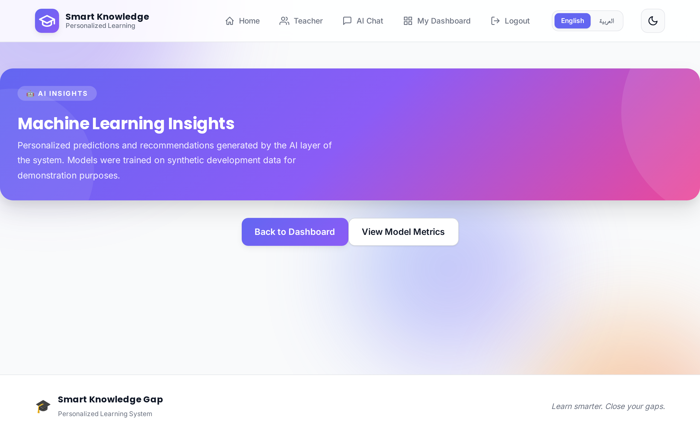

### 🧠 Feynman Board — Explain concepts in your own words
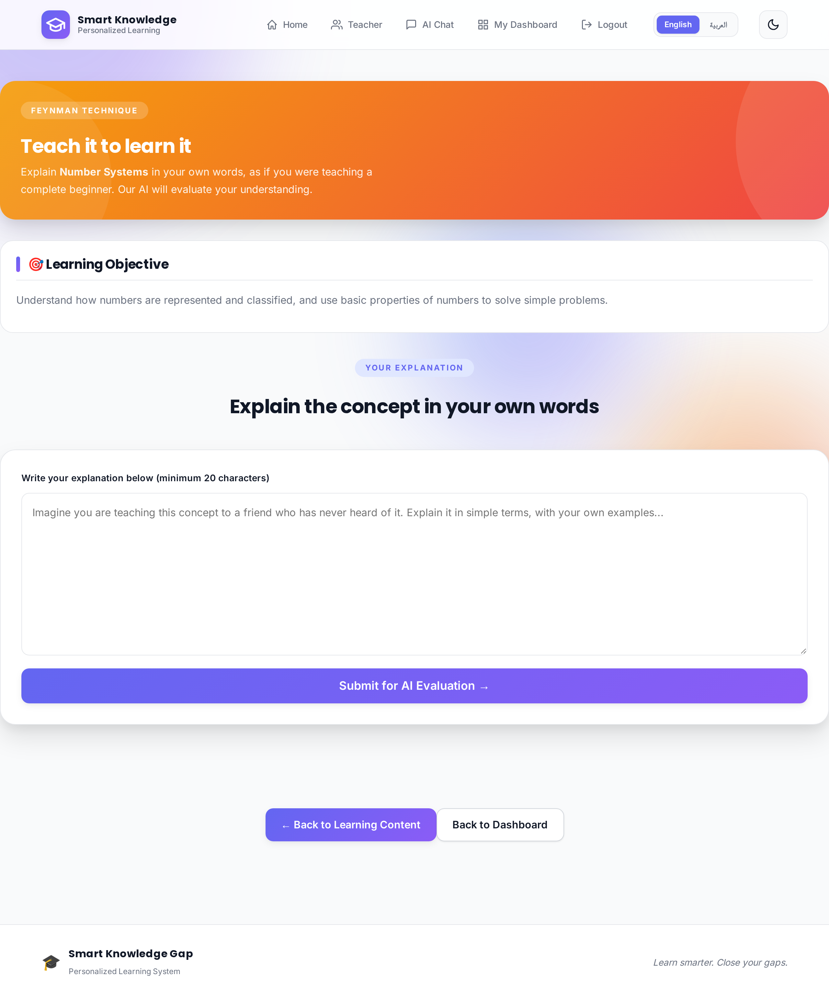

### 💬 AI Chat Assistant — LLM + RAG powered
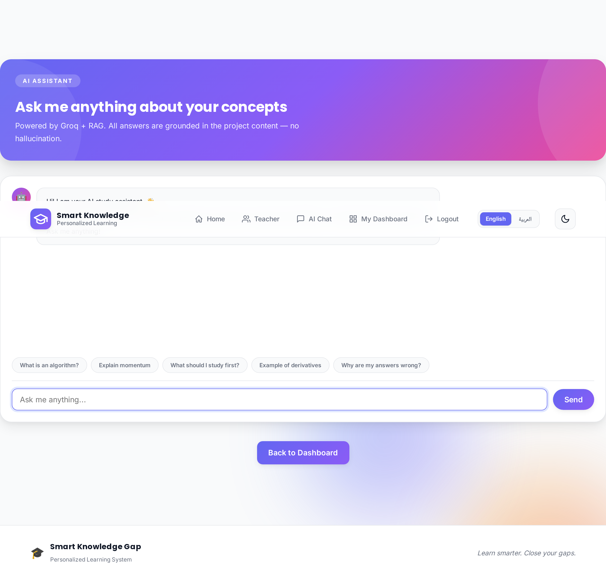

### 👨‍🏫 Teacher Dashboard — Class-level analytics
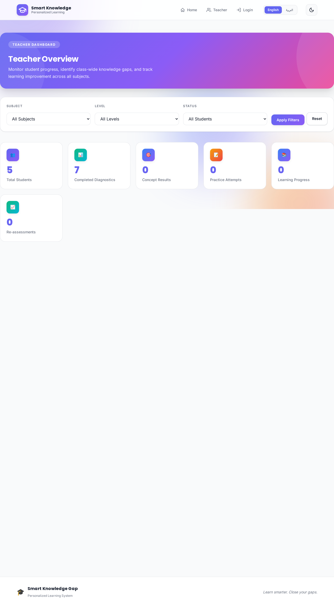

### 📈 ML Metrics — Public model performance dashboard
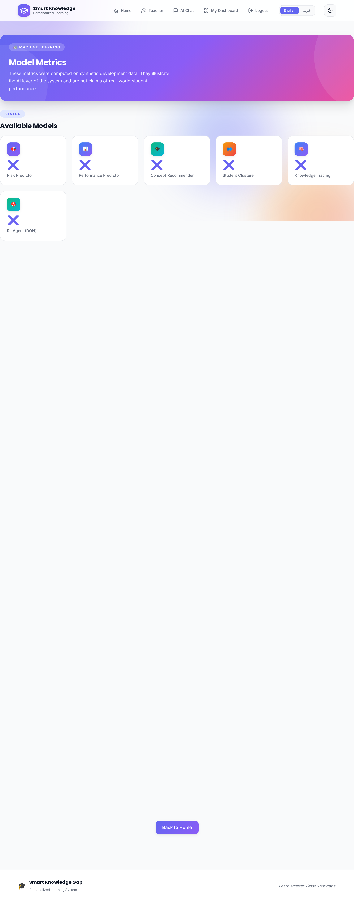

### 🎨 UI Features

| 🌙 Dark Mode | 🌍 Arabic RTL |
|:------------:|:-------------:|
| 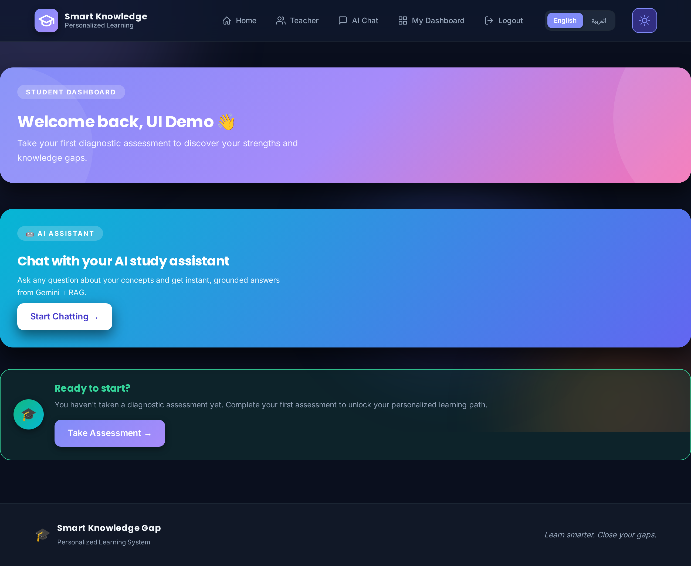 | 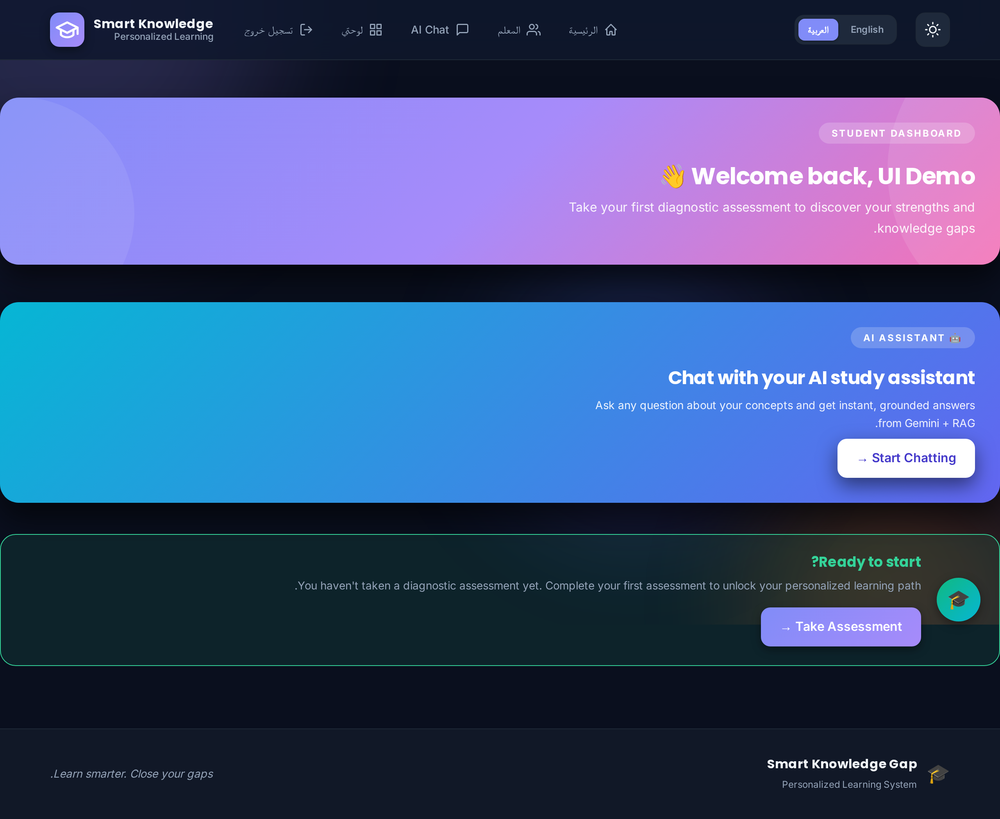 |

---

## 🎯 Overview

Traditional assessments tell students **what score they got** — but not **what to study next**. This system closes that gap:

1. **Detects knowledge gaps** at the concept level (not just chapter level)
2. **Prioritizes** concepts based on prerequisites and impact
3. **Generates personalized learning paths** that adapt in real time
4. **Explains AI decisions** using SHAP values for transparency
5. **Assists learning** with an LLM + RAG chat assistant

---

## ✨ Key Features

### 🎯 Adaptive Learning Engine
- **270-question bank** across multiple subjects & difficulty levels
- **Concept-level diagnosis** — not just correct/incorrect, but *why*
- **Prerequisite-aware learning paths** — teaches in the right order
- **Feynman technique** — students explain concepts; AI evaluates depth
- **Reassessment loop** — tracks growth over time

### 🤖 8 Machine Learning Models

| # | Model | Technique | Metric |
|---|-------|-----------|--------|
| 1 | **Risk Predictor** | Gradient Boosting | F1 = **89.63%** |
| 2 | **Performance Predictor** | Random Forest (4-class) | Multiclass |
| 3 | **Concept Recommender** | Hybrid (Content + Collaborative) | — |
| 4 | **Student Clusterer** | K-Means + PCA | 4 clusters |
| 5 | **Knowledge Tracing** | LSTM | Acc = **70.83%** |
| 6 | **SHAP Explainer** | Per-prediction | — |
| 7 | **LLM + RAG Assistant** | Groq LLaMA + Qdrant | 675 docs |
| 8 | **RL Agent (DQN)** | Deep Q-Network | Reward = 18.77 |

### 🎨 User Experience
- **Multi-language** — English & Arabic with full RTL support
- **Dark Mode** — one-click toggle everywhere
- **Interactive charts** — Doughnut + Bar (Chart.js)
- **Achievements & badges** — 8 unlockable milestones
- **PDF progress reports** — downloadable for students
- **Custom 404 & 500 pages**

### 🏗️ Engineering
- **20+ REST routes** organized with blueprints
- **PostgreSQL (Supabase Cloud)** with SQLite fallback
- **Qdrant Cloud** vector database for RAG
- **FastEmbed** — lightweight ONNX embeddings
- **CSRF + session hardening** (HttpOnly, Secure, SameSite)
- **Structured logging** with rotating file handler
- **Docker + docker-compose + Makefile**
- **GitHub Actions CI** — 57 tests, 100% passing

---

## 🛠️ Tech Stack

| Layer | Technologies |
|-------|--------------|
| **Backend** | Python 3.11, Flask 3.1, Gunicorn |
| **Databases** | Supabase PostgreSQL, Qdrant Cloud, SQLite (dev) |
| **ML / DS** | scikit-learn, pandas, numpy, SHAP, PyTorch, FastEmbed |
| **AI / LLM** | Groq API, Qdrant RAG, FastEmbed |
| **Frontend** | Jinja2, Chart.js, Vanilla JS, Custom CSS3 (RTL) |
| **DevOps** | Faable Cloud, GitHub Actions, Docker, Makefile |
| **Testing** | pytest (57 tests) |

---

## 🏛️ System Architecture

```
┌──────────────────────────────────────────────────────────┐
│                    Browser (HTML/CSS/JS)                 │
└────────────────────────┬─────────────────────────────────┘
                         │ HTTPS
                         ▼
┌──────────────────────────────────────────────────────────┐
│                  Flask App (Gunicorn)                    │
│  ┌────────────────┐  ┌───────────────┐  ┌─────────────┐  │
│  │  Auth Routes   │  │ Learning Flow │  │  ML Routes  │  │
│  └────────────────┘  └───────────────┘  └─────────────┘  │
└─────┬─────────────────┬──────────────────┬───────────────┘
      │                 │                  │
      ▼                 ▼                  ▼
┌───────────┐  ┌─────────────────┐  ┌───────────────┐
│ Supabase  │  │  Qdrant Cloud   │  │  Groq LLM     │
│ Postgres  │  │  (Vector DB)    │  │  (Llama 3)    │
└───────────┘  └─────────────────┘  └───────────────┘
```

---

## 🚀 Quick Start

### Prerequisites
- Python **3.11+**
- PostgreSQL (or SQLite for local dev)
- *(optional)* Qdrant Cloud + Groq API key for AI features

### Local Installation

```bash
# 1. Clone
git clone https://github.com/qamarsobhy7-source/Smart-Knowledge-Gap-System.git
cd Smart-Knowledge-Gap-System

# 2. Virtual environment
python -m venv venv
source venv/bin/activate       # Windows: venv\Scripts\activate

# 3. Dependencies
pip install -r requirements.txt

# 4. Environment variables
cp .env.example .env
# edit .env with: DATABASE_URL, SECRET_KEY, QDRANT_URL,
#                 QDRANT_API_KEY, GROQ_API_KEY

# 5. Initialize DB
python -m app.init_database

# 6. Run
python -m app.app
```

Open **http://localhost:5000** in your browser.

### 🐳 Run with Docker

```bash
docker-compose up --build
```

---

## 📁 Project Structure

```
Smart-Knowledge-Gap-System/
├── app/
│   ├── app.py                       # Flask main app (20+ routes)
│   ├── database.py                  # DB abstraction (Postgres + SQLite)
│   ├── backend_service.py           # Business logic
│   ├── repository.py                # Data access layer
│   ├── init_database.py             # Schema init
│   ├── diagnostic_engine.py         # Gap detection
│   ├── priority_engine.py           # Concept prioritization
│   ├── learning_path_engine.py      # Path builder
│   ├── student_dashboard_service.py
│   ├── teacher_dashboard_service.py
│   ├── pdf_report.py                # PDF generation
│   └── translations.py              # EN + AR strings
├── ml/
│   ├── train_all.py                 # Rebuild all 8 models
│   ├── risk_predictor.py
│   ├── performance_predictor.py
│   ├── concept_recommender.py
│   ├── student_clusterer.py
│   ├── knowledge_tracing.py
│   ├── shap_explainer.py
│   ├── llm_rag_assistant.py
│   └── rl_agent.py
├── templates/                       # Jinja2 templates
├── static/                          # CSS, JS, images
├── data/
│   └── final_question_bank_270.csv
├── docs/
│   ├── screenshots/                 # 13 app screenshots
│   ├── videos/demo.mp4              # Demo video
│   └── research_paper.md            # Academic paper
├── tests/
│   └── test_complete.py             # 57 tests
├── .github/workflows/ci.yml
├── Dockerfile
├── docker-compose.yml
├── Makefile
├── requirements.txt
└── README.md
```

---

## 🧪 Testing

```bash
pytest tests/test_complete.py -v
# → 57 passed in ~30s
```

**Coverage:** authentication, assessment flow, dashboard data, ML inference, API routes, DB operations, session management.

---

## 🧠 ML Pipeline

### Train all models from scratch

```bash
python ml/train_all.py
```

### Model details

- **Risk Predictor** — early warning for at-risk students (GBM, F1=89.63%)
- **Performance Predictor** — 4-class student level (Random Forest)
- **Concept Recommender** — hybrid content-based + collaborative filtering
- **Student Clusterer** — K-Means with PCA (4 archetypes)
- **Knowledge Tracing** — LSTM sequence model (Acc=70.83%)
- **SHAP Explainer** — per-prediction feature importance
- **LLM + RAG** — Groq Llama + Qdrant vector search (675 documents)
- **RL Agent (DQN)** — adaptive question selection policy

---

## 📚 Research Paper

A full academic paper (8 sections, 20 references) lives in [`docs/research_paper.md`](docs/research_paper.md):

- Problem statement & motivation
- Related work (ITS, knowledge tracing, adaptive learning)
- System architecture
- ML methodology & evaluation
- RAG pipeline for LLM assistant
- Experimental results
- Limitations & future work

---

## 🔒 Security

- **CSRF protection** on all forms (Flask-WTF tokens)
- **Session hardening** — HttpOnly, Secure, SameSite=Lax
- **Password hashing** — Werkzeug PBKDF2
- **No secrets in code** — env vars only
- **SQL injection prevention** — parameterized queries
- **Rate limiting** on auth & chat endpoints

---

## 🌍 Deployment

### Faable Cloud (Production)

| Item | Value |
|------|-------|
| URL | https://smart-knowledge-gap-system-qqbms.faable.link |
| Runtime | Python 3.11.3 |
| Server | Gunicorn |
| Database | Supabase PostgreSQL |
| Vector DB | Qdrant Cloud |
| Auto-deploy | Every push to `master` |

### Required Environment Variables

| Variable | Purpose |
|----------|---------|
| `DATABASE_URL` | PostgreSQL connection string |
| `SECRET_KEY` | Flask session encryption |
| `QDRANT_URL` | Qdrant cluster endpoint |
| `QDRANT_API_KEY` | Qdrant authentication |
| `GROQ_API_KEY` | Groq LLM access |

---

## 🗺️ Roadmap

- [x] Adaptive assessment engine
- [x] 8 ML models in production
- [x] LLM + RAG chat assistant
- [x] Feynman technique board
- [x] Multi-language (EN + AR)
- [x] PDF reports
- [x] Docker + CI/CD
- [ ] Mobile app (React Native)
- [ ] Real-time collaboration
- [ ] Gamification v2

---

## 🤝 Contributing

1. Fork the repository
2. Create a feature branch: `git checkout -b feature/amazing-feature`
3. Commit your changes: `git commit -m 'Add amazing feature'`
4. Push: `git push origin feature/amazing-feature`
5. Open a Pull Request

---

## 📄 License

Released under the **MIT License** — see [LICENSE](LICENSE).

---

## 🙏 Acknowledgments

- **Groq** — ultra-fast LLM inference
- **Supabase** — managed PostgreSQL
- **Qdrant** — vector database for RAG
- **Faable** — cloud hosting
- **FastEmbed** — lightweight ONNX embeddings
- **scikit-learn** — classical ML toolkit

---

<div align="center">

**⭐ If you find this project useful, please give it a star! ⭐**

Made with ❤️ for better learning

</div>
