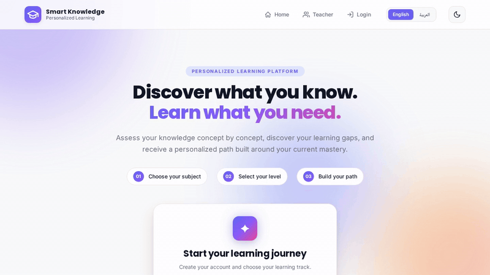

# Smart Knowledge Gap & Personalized Learning System

[](https://www.python.org/)
[](https://flask.palletsprojects.com/)
[](https://scikit-learn.org/)
[](LICENSE)
[](#testing)
[](https://github.com/qamarsobhy7-source/Smart-Knowledge-Gap-System/releases)

A concept-level diagnostic and personalized learning platform that identifies knowledge gaps, prioritizes learning needs, and generates prerequisite-aware learning paths.

---

## Live Demo & Video

### Try the App

**https://smart-knowledge-gap-system-qqbms.faable.link**

### Watch the Demo Video

[](https://qamarsobhy7-source.github.io/Smart-Knowledge-Gap-System/)

### Preview



---

## Screenshots

### Homepage


### Student Dashboard


### AI Insights


[View all 13 screenshots →](docs/SCREENSHOTS.md)

---

## Overview

Traditional assessments tell students what score they got — but not what to study next. This system closes that gap:

- Detects knowledge gaps at the **concept level** (not just chapter level)
- Prioritizes concepts based on **prerequisites and impact**
- Generates **personalized learning paths** that adapt in real time
- Explains AI decisions using **SHAP values** for transparency
- Assists learning with an **LLM + RAG chat assistant**

---

## Features

### Adaptive Learning Engine

- 270-question bank across multiple subjects and difficulty levels
- Concept-level diagnosis — not just correct/incorrect, but why
- Prerequisite-aware learning paths — teaches in the right order
- Feynman technique — students explain concepts; AI evaluates depth
- Reassessment loop — tracks growth over time

### Machine Learning (8 Models)

| Model | Technique | Metric |
|-------|-----------|--------|
| Risk Predictor | Gradient Boosting | F1 = 89.63% |
| Performance Predictor | Random Forest (4-class) | Multiclass |
| Concept Recommender | Hybrid (Content + Collaborative) | — |
| Student Clusterer | K-Means + PCA | 4 clusters |
| Knowledge Tracing | LSTM | Acc = 70.83% |
| SHAP Explainer | Per-prediction | — |
| LLM + RAG Assistant | Groq LLaMA + Qdrant | 675 docs |
| RL Agent (DQN) | Deep Q-Network | Reward = 18.77 |

### User Experience

- Multi-language — English and Arabic with full RTL support
- Dark mode — one-click toggle
- Interactive charts — Doughnut + Bar (Chart.js)
- Achievements and badges — 8 unlockable milestones
- PDF progress reports — downloadable per student
- Custom 404 and 500 error pages

### Engineering

- 20+ REST routes organized with blueprints
- PostgreSQL (Supabase Cloud) with SQLite fallback
- Qdrant Cloud vector database for RAG
- FastEmbed — lightweight ONNX embeddings
- CSRF protection + session hardening (HttpOnly, Secure, SameSite)
- Structured logging with rotating file handler
- Docker + docker-compose + Makefile
- GitHub Actions CI — 94 tests, 100% passing
- Rate limiting with Flask-Limiter
- Health check endpoint — `/health`
- Performance timing — `X-Response-Time` header
- API version endpoint — `/api/version`
- SEO — robots.txt, sitemap.xml, Open Graph, Twitter Cards
- Accessibility — skip link, ARIA, focus-visible, reduced-motion
- security.txt — RFC 9116 compliant vulnerability reporting

---

## Tech Stack

| Layer | Technologies |
|-------|--------------|
| Backend | Python 3.11, Flask 3.1, Gunicorn |
| Databases | Supabase PostgreSQL, Qdrant Cloud, SQLite (dev) |
| ML / DS | scikit-learn, pandas, numpy, SHAP, PyTorch, FastEmbed |
| AI / LLM | Groq API, Qdrant RAG, FastEmbed |
| Frontend | Jinja2, Chart.js, Vanilla JS, Custom CSS3 (RTL) |
| DevOps | Faable Cloud, GitHub Actions, Docker, Makefile |
| Testing | pytest (94 tests) |

---

## Quick Start

### Prerequisites

- Python 3.11+
- PostgreSQL (or SQLite for local development)
- Optional: Qdrant Cloud + Groq API key for AI features

### Local Installation

```bash
git clone https://github.com/qamarsobhy7-source/Smart-Knowledge-Gap-System.git
cd Smart-Knowledge-Gap-System

python -m venv venv
source venv/bin/activate

pip install -r requirements.txt

cp .env.example .env

python -m app.init_database
python -m app.app
```

The app will be available at `http://localhost:5000`.

### Docker

```bash
docker-compose up --build
```

---

## Project Structure

```
Smart-Knowledge-Gap-System/
├── app/                          # Flask application
│   ├── app.py                    # Main app (20+ routes)
│   ├── database.py               # DB abstraction
│   ├── backend_service.py        # Business logic
│   ├── repository.py             # Data access layer
│   ├── diagnostic_engine.py      # Gap detection
│   ├── priority_engine.py        # Concept prioritization
│   ├── learning_path_engine.py   # Path builder
│   ├── student_dashboard_service.py
│   ├── teacher_dashboard_service.py
│   ├── pdf_report.py             # PDF generation
│   ├── translations.py           # EN + AR strings
│   └── ml/                       # 8 ML models
├── templates/                    # 17 Jinja2 templates
├── static/                       # CSS, JS, images
├── data/                         # Question bank + learning content
├── models/                       # Trained ML models
├── docs/                         # API + research paper + screenshots
├── tests/                        # 94 tests
├── .github/workflows/ci.yml      # GitHub Actions
├── Dockerfile
├── docker-compose.yml
├── Makefile
├── requirements.txt
├── requirements-dev.txt
├── .env.example
├── LICENSE
├── CONTRIBUTING.md
├── SECURITY.md
├── CHANGELOG.md
├── CITATION.cff
└── README.md
```

---

## ML Models

### Train All Models from Scratch

```bash
python -m app.ml.train_all
```

### Model Cards

Detailed documentation for each model is available in `docs/models/`:

- [Risk Predictor](docs/models/risk_predictor.md)
- [Knowledge Tracing](docs/models/knowledge_tracing.md)
- [Student Clusterer](docs/models/student_clusterer.md)

---

## Testing

### Test Suites

| Suite | File | Tests | Focus |
|-------|------|-------|-------|
| Core | `tests/test_complete.py` | 52 | End-to-end functionality |
| Security | `tests/test_security.py` | 33 | CSRF, SQL injection, XSS, auth |
| Integration | `tests/test_full_flow.py` | 9 | Full assessment flow |
| **Total** | — | **94** | **100% passing** |

### Run Tests

```bash
pytest tests/ -v

coverage run -m pytest tests/
coverage report -m
```

### What the Security Suite Validates

- CSRF protection — form tokens required on all POST requests
- SQL injection prevention — 5 attack payloads tested
- XSS prevention — 4 payloads tested, HTML escaping verified
- Authentication — protected routes require login
- Session security — HttpOnly, Secure, SameSite flags
- Password hashing — PBKDF2/scrypt, never plain text
- Input validation — email format, password length, duplicate handling
- Error handling — no stack trace leaks on 404

---

## API Reference

Full API documentation is available in `docs/API.md`.

- **21 endpoints** across 8 categories
- **Postman collection:** `docs/postman_collection.json`
- **Health check:** `GET /health`
- **API version:** `GET /api/version`

### Example Request

```bash
curl https://smart-knowledge-gap-system-qqbms.faable.link/health
```

**Response:**

```json
{
  "status": "healthy",
  "service": "smart-knowledge-gap-system",
  "version": "1.0.9",
  "services": {
    "database": {"status": "connected"},
    "qdrant": {"status": "configured"},
    "groq": {"status": "configured"},
    "ml_models": {"status": "loaded", "count": 9}
  }
}
```

## Deployment

**Production:** [smart-knowledge-gap-system-qqbms.faable.link](https://smart-knowledge-gap-system-qqbms.faable.link)

| Item | Value |
|------|-------|
| Runtime | Python 3.11.3 |
| Server | Gunicorn |
| Database | Supabase PostgreSQL |
| Vector DB | Qdrant Cloud |
| Auto-deploy | Every push to `master` |

### Required Environment Variables

| Variable | Purpose |
|----------|---------|
| `DATABASE_URL` | PostgreSQL connection string |
| `SECRET_KEY` | Flask session encryption |
| `QDRANT_URL` | Qdrant cluster endpoint |
| `QDRANT_API_KEY` | Qdrant authentication |
| `GROQ_API_KEY` | Groq LLM access |

## Security

- CSRF protection on all forms (Flask-WTF tokens)
- Session hardening — HttpOnly, Secure, SameSite=Lax
- Password hashing — Werkzeug PBKDF2
- No secrets in code — environment variables only
- SQL injection prevention — parameterized queries
- Rate limiting on authentication and chat endpoints

For vulnerability reporting, see `SECURITY.md`.

## Research Paper

A full academic paper (8 sections, 20 references) is available in `docs/research_paper.md`:

1. Problem statement and motivation
2. Related work (ITS, knowledge tracing, adaptive learning)
3. System architecture
4. ML methodology and evaluation
5. RAG pipeline for LLM assistant
6. Experimental results
7. Limitations and future work

## Contributors

- [@qamarsobhy7-source](https://github.com/qamarsobhy7-source) — Creator & Maintainer

---

## License

Released under the [MIT License](LICENSE).
